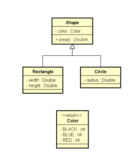

# Métodos abstratos
## • São métodos que não possuem implementação.
## • Métodos precisam ser abstratos quando a classe é genérica demais para conter sua implementação.
## • Se uma classe possuir pelo menos um método abstrato, então esta classe também é abstrata.
## • Notação UML: itálico
## • Exercício resolvido

