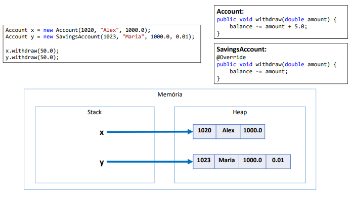

# POLIMORFISMO

## Em Programação Orientada a Objetos, polimorfismo é recurso que permite que variáveis de um mesmo tipo mais genérico possam apontar para objetos de tipos específicos diferentes, tendo assim comportamentos diferentes conforme cada tipo específico.
~~~
Account x = new Account(1020, "Alex", 1000.0);
Account y = new SavingsAccount(1023, "Maria", 1000.0, 0.01);
x.withdraw(50.0);
y.withdraw(50.0);
~~~

## IMPORTANTE SABER
### • A associação do tipo específico com o tipo genérico é feita em tempo de execução (upcasting).
### • O compilador não sabe para qual tipo específico a chamada do método Withdraw está sendo feita (ele só sabe que são duas variáveis tipo Account):

~~~
Account x = new Account(1020, "Alex", 1000.0);
Account y = new SavingsAccount(1023, "Maria", 1000.0, 0.01);
x.withdraw(50.0);
y.withdraw(50.0);
~~~