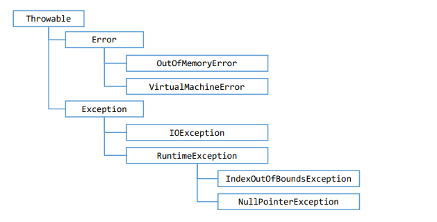

# Exceções 
## • Uma exceção é qualquer condição de erro ou comportamento inesperado encontrado por um programa em execução
## • Em Java, uma exceção é um objeto herdado da classe:
## • java.lang.Exception - o compilador obriga a tratar ou propagar
## • java.lang.RuntimeException - o compilador não obriga a tratar ou propagar
## • Quando lançada, uma exceção é propagada na pilha de chamadas de métodos em execução, até que seja capturada (tratada) ou oprograma seja encerrado

# Hierarquia de exceções do Java
https://docs.oracle.com/javase/10/docs/api/java/lang/package-tree.html

